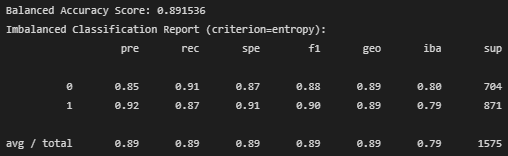

# ucb-data-analytics-2022-team-project

This is a team collaboration project relevant to Machine Learning, Neural Networks, and predictions based on various learning models.

## Table of Contents

- [Overview of Project](#overview-of-project)
  - [Team Member](#team-member)
  - [Topic Selection](#topic-selection)
  - [Purpose of Project](#purpose-of-project)
  - [Current Status](#current-status)
- [Segment 1: Sketch It Out](#segment-1-sketch-it-out)
  - [Resources](#resources)
  - [Model Selection Criteria](#model-selection-criteria)
  - [Roles and Contributions in Segment 1](#roles-and-contributions-in-segment-1)
- [Segment 2: Build and Assemble](#segment-2-build-and-assemble)
  - [Data Exploration Phase](#data-exploration-phase)
  - [Analysis Results](#analysis-results)
  - [Roles and Contributions in Segment 2](#roles-and-contributions-in-segment-2)
- [Segment 3: Put It All Together](#segment-3-put-it-all-together)
  - [Summary of Model Selection](#summary-of-model-selection)
  - [Result of Optimization](#result-of-optimization)
  - [Future Recommendation](#future-recommendation)
  - [Roles and Contributions in Segment 3](#roles-and-contributions-in-segment-3)
  - [Lessons Learned](#lessons-learned)
- [Technologies and Software](#technologies-and-Software)
- [Acknowledgment](#acknowledgment)

## Overview of Project

This project is divided into three Segments: Segment 1, Segment 2, and Segment 3. A checkbox with checkmark in it indicates that the corresponding segment and tasks are completed. 

- ✅ Segment 1: Sketch It Out.
- ✅ Segment 2: Build and Assemble.
- ✅ Segment 3: Put It All Together.

### Team Member

Andia, Chris, Joey, Liwen, and Parto (alphabetical order).

### Topic Selection

We began exploring different datasets to address the question of when a company should execute layoffs. Unfortunately, for IPOs, the datasets we found contained less than 500 rows of relevant data. This seemed too small to create a robust machine learning model. We continued to explore different datasets regarding layoffs, but also began exploring the idea of creating a project regarding customer churn. One question to answer regarding customer churn is, what are the factors that lead to a customer either continuing or terminating their involvement (subscription, account, etc.) with the company. After viewing some datasets on telecom and bank customer churn, it seemed that these datasets had sufficient dimensions (such as tenure and credit score for the bank datasets) and many rows over 10000 to create a learning model. We will continue exploring this idea during the second class of our Final Project. Here is the link to the original dataset selected for our deep dive, [Churn of Bank Customers](https://www.kaggle.com/datasets/mathchi/churn-for-bank-customers?resource=download).

Questions that our team plans to answer is how to predict churn rate of customers based on bank customers' involvement, the reason(s) why customers left, and whether Machine Learning or Neural Network models can help our stakeholders solve.

### Purpose of Project

This project was the final team project to cultivate collaboration, teamwork, and effective use of collaboration tools, such as GitHub, Database Management System (DBMS), and online story board/dashboard. During this project, we were also encouraged to focus on Machine Learning or Neural Network models, and apply those techniques to solve a real world case study. Here are a few systematic steps that we have taken to find the best performing solution(s).

- Examine historical dataset.
- Preprocess the dataset, including proper data cleaning, standardization, and scaling whichever is necessary.
- Identify potential causes for bank customer churn.
- Develop Machine learning model to predict churn rate.

### Current Status

- ✅ Topic selection has been finalized: prediction of bank customer churn rate.

- ✅ Assessment of dataset and database management system (DBMS) is completed.
  - Our dataset consisted of 10000 rows and 14 columns (1 target and 13 features). A few numeric columns contained some outliers as illustrated in Fig. 1(a)&ndash;(c).
  - A PostgreSQL database that stores three tables, called **main_df**, **clean_df**, and **clean_lt2sigma_df**, was created and can be connected without problems from/to Python code via an Object Relational Mapper (ORM) technique. We documented some SQL queries for retrieving some data from the database ([BankCustomerChurn_ModelSelection.ipynb](./BankCustomerChurn_ModelSelection.ipynb) and Fig. 2).

  <hr>
  <table><tr><td></td><td></td><td></td></tr></table>

  **Fig. 1 Boxplots of several numerical columns containing some outliers: (a) Column CreditScore, (b) Column Age, and (c) Column NumOfProducts.**
  <hr>
  <table><tr><td></td><td></td></tr></table>

  **Fig. 2 Bank Customer Churn fabricated DBMS (PostgreSQL) with three tables properly stored. SQL query examples showing a relationship between credit scores and (a) Exited=0 (customers who stayed with the banks), (b) Exited=1 (customers who left the banks).**
  <hr>

- ✅ Preprocessing dataset and EDA is completed. The cleaned datasets, [Churn_Modelling_main.csv](./Resources/Churn_Modelling_main.csv), [Churn_Modelling_cs_lt850.csv](./Resources/Churn_Modelling_cs_lt850.csv) and [Churn_Modelling_cs_lt2sigma.csv](./Resources/Churn_Modelling_cs_lt2sigma.csv), are stored in the GitHub repo and PostgreSQL database.

- ✅ Model Testing and Determination.
  - Evaluation of Machine Learning or Neural Network models that could effectively predict bank customer churn rate.
  - Optimization of our final models is completed.

- ✅ Final Presentation.
  - Final presentation and story/dashboard are also available online.

## Segment 1: Sketch It Out

Our team discussed our overall project objectives and resources (datasets, technologies, software, ML/NN models, etc.), selected a question/topic to focus on, and then built a simple model. We then prototyped our team's ideas by using either CSV or JSON files to connect the model to a fabricated database.

### Resources

- GitHub repository: [Bank-Customer-Churn](https://github.com/chris820629/Bank-Customer-Churn) for sharing our analysis details, datasets, and results.
- Source code: [BankCustomerChurn_EDA.ipynb](./BankCustomerChurn_EDA.ipynb), [BankCustomerChurn_ModelSelection.ipynb](./BankCustomerChurn_ModelSelection.ipynb), [RandomForestOptimization.ipynb](./RandomForestOptimization.ipynb).
- Source data: [Churn_Modelling_2.csv](./Resources/Churn_Modelling_2.csv) (source: [Churn of Bank Customers](https://www.kaggle.com/datasets/mathchi/churn-for-bank-customers?resource=download)).
- Database data: [Churn_Modelling_main.csv](./Resources/Churn_Modelling_main.csv), [Churn_Modelling_cs_lt850.csv](./Resources/Churn_Modelling_cs_lt850.csv), [Churn_Modelling_cs_lt2sigma.csv](./Resources/Churn_Modelling_cs_lt2sigma.csv).
- Fabricated DBMS: PostgreSQL (Fig. 2 in [Current Status](#current-status) subsection).
- Object Relational Mapper (ORM): [SQLAlchemy](https://www.sqlalchemy.org/).
- Image file: png files.
- Software: [Pandas User Guide](https://pandas.pydata.org/pandas-docs/stable/user_guide/index.html#user-guide), [Scikit-learn User Guide - Supervised Learning](https://scikit-learn.org/stable/supervised_learning.html), [Python imbalanced-learn](https://pypi.org/project/imbalanced-learn/).
- Tableau dashboard: [Tableau Dashboard](https://public.tableau.com/views/BankCustomerChurnAnalysis_Story/BankCustomerChurnAnalysis?:language=en-US&:display_count=n&:origin=viz_share_link).
- Final presentation: [Presentation Deck](https://docs.google.com/presentation/d/13GpnlnnnRCzY-2b2ARRzl8KAefaf1cVX/edit?usp=sharing&ouid=103214317682191239328&rtpof=true&sd=true).

### Model Selection Criteria

Based on our assessment and analysis of the bank customer churn dataset, a few machine learning models were isolated and applied to optimize our predictions. Below is the summary of the model selection criteria that we have applied in this study.

- Is the label variable known? **Yes**. We then narrowed down our models to either supervised learning or neural network models.
- Is the target variable categorical? **Yes**. Our target variable contained dichotomous (binary) categorical values, which suggested that classification-based supervised learning would be effective in predicting bank customer churn rate.
- Do our features contain numerical (continuous/interval) and categorical (*object* or *string* data type) values? **Yes**. We then applied Pandas `cut()` to optimize binning/classification and `get_dummies()` method to encode those categorical values.
- Out of 10000 total rows, the ratio of our target values was approximately 4:1, which could be considered imbalanced. One of the over-/under-sampling combination techniques called `SMOTEENN` could be employed to rebalance our target values. BalancedRandomForestClassifier would be better than typical `SMOTEENN` or bagging classifiers because it learns from imbalanced bootstrap samples.

### Roles and Contributions in Segment 1

My major roles and contributions in **Segment 1** were as follows:

- A total of 6 commits to the team project GitHub repository.
- Completed analysis by using three ensemble learning models, called `BalancedRandomForestClassifier`, `EasyEnsembleClassifier`, and `AdaBoostClassifier` for predicting churn rate of customers based on bank customers' involvement ([BankCustomerChurn_ModelSelection.ipynb](./BankCustomerChurn_ModelSelection.ipynb)). We preprocessed our dataset and saved the clean datasets in our team project GitHub and a PostgreSQL database. We mainly used StandardScaler, but scaling was skipped in some cases because Random Forests and Decision Trees are based on tree partitioning algorithms. To ensure there were no overlapping tasks in our team, the rest of the Team Members performed several types of Machine Learning and Neural Network models.
- Supported Andia, Joey, and the rest of Team Members on:
  - how to set up a GitHub repository and branch correctly and effectively.
  - how to checkout, commit, push a branch, and how to merge individual branches with the main branch correctly. We also made sure that our GitHub repo is protected and has proper review steps before Team Member can merge, modify, or delete shared codes/files.
  - best known methods for mastering GitHub repos, GitBash, Python code, and Jupyter Notebook code.
- Created a Python code that allows each Team Member to communicate with the PostgreSQL database via pgAdmin 4, SQLAlchemy, and Psycopg2.
- Helped other Team Members spot problems in their codes and correct them.
- Helped setting up GitHub main and local branches of each Team Member correctly. I also helped setting up the *gitignore* afterward because the team project GitHub repo was initially created without *gitignore* and without any protection modes.

## Segment 2: Build and Assemble

Our team performed some experiments to test and train our models, build the database that we will use for our final presentation, and create both our dashboard and presentation.

### Data Exploration Phase

We followed some phases within the full spectrum of the data science life cycle that were applicable to our project, which can be summarized as follows.

- *Capture*: data acquisition and extraction. During this phase, our team explored several databases online to find sufficiently large datasets that we could train and test for ML/NN. At first, we tried to do layoff prediction, but we found out that the layoff dataset was not large enough for ML/NN modelling study, which forced us to change our topic to bank customer churn prediction and delay the start of subsequent data science phases.
- *Maintain*: data storage, cleansing, and preprocessing. During this phase, our team created a fabricated database, cleaned the original dataset, and applied feature engineering to preprocess the dataset prior to training and testing.
- *Process*: data mining, binning, classification, and summarization. During this phase, we revealed that binning and classification by using `pandas.cut()` method targeting the *Age* and *CreditScore* data did not improve our prediction results. We then used another feature engineering technique for trimming a few outliers, such as unrealistic credit scores &ge; 850. We also processed another clean dataset, in which *CreditScore* and *Age* data were limited within &pm;2 &sigma; ranges.
- *Analyze*: exploratory data analysis, model(s) selection analysis, regression analysis, and qualitative analysis. Each of us analyzed a few candidate models and compared the results before finalizing the best performing model for predicting our dataset. After completing the model selection step, we then execute several optimization techniques to improve our preliminary models. This training and testing phase was done by sequentially tuning several hyperparameters to derive the optimal parameters for our final models of choice and finally, we performed qualitative analyses for ensuring that the optimized models were able to better predict the bank customer churn.
- *Communicate*: data reporting, data visualization, drawing findings and conclusions, and presentation.

### Analysis Results

**Table 1. Condensed summary statistics of all ensemble learning models (Used datasets: *Original* with all outliers vs. *CS &lt; 850* without credit scores >= 850. Used metrics: low &lt; 60%, good = 60&ndash;70%, very good = 70&ndash;90%, high &ge; 90%).**  
| Ensemble algorithm     | Dataset-Exited | Balanced<br> accuracy score | Precision | Recall  | F1 score | Conclusion                         |
| :--                    | :--:           |           :--: |       --: |     --: |      --: | :--                                             |
| RandomForestClassifier | Original-0     |   0.736840     | 0.89      |    0.90 |  0.90    | Very good accuracy; **high recall/F1 score**    |
| (with SMOTEENN)        | Original-1     |   0.736840     | 0.61      |    0.57 |  0.59    | Very good accuracy; *low recall/F1 score*       |
| RandomForestClassifier | Original-0     |   0.712432     | 0.87      |    0.97 |  0.92    | Very good accuracy; **high recall/F1 score**    |
|                        | Original-1     |   0.712432     | 0.79      |    0.46 |  0.58    | Very good accuracy; *low recall/F1 score*       |
| BalancedRandomForest   | Original-0     |   0.730740     | 0.88      |    0.93 |  0.91    | Very good accuracy; **high recall/F1 score**    |
| (with SMOTEENN)        | Original-1     |   0.730740     | 0.66      |    0.53 |  0.59    | Very good accuracy; *low recall/F1 score*       |
| BalancedRandomForest   | Original-0     |   0.784557     | 0.93      |    0.81 |  0.86    | Very good accuracy/recall/F1 score              |
|                        | Original-1     |   0.784557     | 0.51      |    0.76 |  0.61    | Very good accuracy/recall; good F1 score        |
| EasyEnsembleClassifier | Original-0     |   0.734567     | 0.89      |    0.90 |  0.89    | Very good accuracy/F1 score; **high recall**    |
| (with SMOTEENN)        | Original-1     |   0.734567     | 0.60      |    0.57 |  0.58    | Very good accuracy; *low recall/F1 score*       |
| EasyEnsembleClassifier | Original-0     |   0.778234     | 0.93      |    0.80 |  0.86    | Very good accuracy/recall/F1 score              |
|                        | Original-1     |   0.778234     | 0.50      |    0.75 |  0.60    | Very good accuracy/recall; good F1 score        |
| AdaBoostClassifier     | Original-0     |   0.742793     | 0.90      |    0.87 |  0.88    | Very good accuracy/recall/F1 score              |
| (with SMOTEENN)        | Original-1     |   0.742793     | 0.55      |    0.62 |  0.58    | Very good accuracy; good recall; *low F1 score* |
| AdaBoostClassifier     | Original-0     |   0.729186     | 0.88      |    0.96 |  0.92    | Very good accuracy; **high recall/F1 score**    |
|                        | Original-1     |   0.729186     | 0.78      |    0.49 |  0.61    | Very good accuracy; *low recall*; good F1 score |
| RandomForestClassifier | CS < 850-0     |   0.741063     | 0.90      |    0.89 |  0.89    | Very good accuracy/recall/F1 score              |
| (with SMOTEENN)        | CS < 850-1     |   0.741063     | 0.56      |    0.59 |  0.58    | Very good accuracy; *low recall/F1 score*       |
| RandomForestClassifier | CS < 850-0     |   0.701590     | 0.88      |    0.96 |  0.92    | Very good accuracy; **high recall/F1 score**    |
|                        | CS < 850-1     |   0.701590     | 0.75      |    0.44 |  0.55    | Very good accuracy; *low recall/F1 score*       |
| BalancedRandomForest   | CS < 850-0     |   0.738949     | 0.90      |    0.91 |  0.90    | Very good accuracy; **high recall/F1 score**    |
| (with SMOTEENN)        | CS < 850-1     |   0.738949     | 0.60      |    0.57 |  0.59    | Very good accuracy; *low recall/F1 score*       |
| BalancedRandomForest   | CS < 850-0     |   0.772251     | 0.93      |    0.81 |  0.86    | Very good accuracy/recall/F1 score              |
|                        | CS < 850-1     |   0.772251     | 0.48      |    0.74 |  0.58    | Very good accuracy/recall; *low F1 score*       |
| EasyEnsembleClassifier | CS < 850-0     |   0.741146     | 0.90      |    0.88 |  0.89    | Very good accuracy/recall/F1 score              |
| (with SMOTEENN)        | CS < 850-1     |   0.741146     | 0.55      |    0.60 |  0.58    | Very good accuracy; good recall; *low F1 score* |
| EasyEnsembleClassifier | CS < 850-0     |   0.771172     | 0.93      |    0.79 |  0.85    | Very good accuracy/recall/F1 score              |
|                        | CS < 850-1     |   0.771172     | 0.47      |    0.75 |  0.58    | Very good accuracy/recall; *low F1 score*       |
| AdaBoostClassifier     | CS < 850-0     |   0.753748     | 0.91      |    0.86 |  0.88    | Very good accuracy/recall/F1 score              |
| (with SMOTEENN)        | CS < 850-1     |   0.753748     | 0.53      |    0.65 |  0.58    | Very good accuracy; good recall; *low F1 score* |
| AdaBoostClassifier     | CS < 850-0     |   0.717164     | 0.88      |    0.95 |  0.92    | Very good accuracy; **high recall/F1 score**    |
|                        | CS < 850-1     |   0.717164     | 0.71      |    0.48 |  0.58    | Very good accuracy; *low recall/F1 score*       |

<hr>
<table><tr><td></td><td></td></tr><tr><td></td><td></td></tr></table>

**Fig. 3 Sorted feature importances of (a) the original dataset, (b) the dataset with CreditScore &lt; 850, (c) the original dataset with SMOTEENN, and (d) the dataset with SMOTEENN and CreditScore &lt; 850.**
<hr>

### Roles and Contributions in Segment 2

My major roles and contributions in **Segment 2** were as follows:

- A total of 13 commits to the team project GitHub repository.
- Completed final training and testing of four ensemble learning models, called `RandomForestClassifier`, `BalancedRandomForestClassifier`, `EasyEnsembleClassifier`, and `AdaBoostClassifier` for predicting churn rate of customers based on bank customers' involvement. I also performed the code refactoring, so that our team could run and compare several ML models more efficiently, including two reusable functions for generating summary statistics tables and precision-recall curves ([BankCustomerChurn_ModelSelection.ipynb](./BankCustomerChurn_ModelSelection.ipynb)).
- Helped summarizing the summary statistics table, feature importances, and defined which ML model our team should pursue.
- Helped streamlining the structure of our team project GitHub repo and consolidating some paths and files. I also help updating and prettifying our README.md.
- Maintained the fabricated PostgreSQL database that our team planned to use (Fig. 2 in [Current Status](#current-status) subsection).

## Segment 3: Put It All Together

We put the final touches on our models, database, and dashboard. Then create and deliver our final presentation to the class. We have been working on improving the accuracy and sensitivity of our learning models and preparing story/dashboard for presenting our data effectively.

- Optimization of our learning models.
- Will transform the summary statistics table into a fabricated database that can also be used for Tableau dashboard/story.
- Final touches.

### Summary of Model Selection

**Table 1&ndash;2** summarize the main reasons why we preferred the ensemble learning models over the others for our study. In this project, our team focused on tuning the RandomForestClassifier or BalancedRandomForestClassifier for improving our predictive model.

**Table 2. Assessments of learning model selection (_Ensemble Learning_ RFC: RandomForestClassifier, BRFC: BalancedRandomForestClassifier, EEC: EasyEnsembleClassifier, ABC: AdaBoostClassifier, _Artificial Neural Network_ NN/DNN: Neural Network/Deep Neural Network, _Simple Regression_ LogisticR: LogisticRegression).**  
| Learning algorithm            | RFC  | BRFC | EEC  | ABC  | NN/DNN   | LogisticR |
| :--                           | :--: | :--: | :--: | :--: | :--:     | :--:      |
| Bagging/Bootstrap Aggregating | Yes  | Yes  | No   | No   | Yes      |  No       |
| Boosting                      | No   | No   | Yes  | Yes  | Yes      |  No       |
| Simple & fast training time   | No   | No   | No   | No   | No       |  Yes      |
| Applicable to large datasets  | Yes  | Yes  | Yes  | Yes  | Yes      |  No       |
| Applicable to non-linear data | Yes  | Yes  | Yes  | Yes  | Yes      |  No       |
| Applicable to many features   | Yes  | Yes  | Yes  | Yes  | Yes      |  No       |
| Require scaling of features   | No   | No   | No   | No   | Yes or No |  Yes      |
| Robust to under/overfitting   | Yes  | Yes  | No   | No   | No       |  No       |
| Model interpretation          | Yes  | Yes  | Yes  | Yes  | Black box |  Yes      |
| Suitable for this project     | 🟢  | 🟢  | 🟢  | 🟡  | 🟡      |  ⛔       |
| Learning models of choice     | 💚  | 💚    | 💛  | 💛  | 💛      |  💔       |

### Result of Optimization

Fig. 4&ndash;6 and **Table 3** illustrate the performance of our final model after several optimization iterations. The optimal hyperparameters that we approximated based on our computational and shmoo results were summarized below. Fig. 6 shows the accuracy, recall for Exited=1 (customers who left the banks), and F1-score of the optimized models when we factored in all these parameters.

```
criterion = 'gini'  # 'entropy' showed comparable results
max_depth = 12
n_estimators = 90
max_samples = 2800
max_features = 9
```

<hr>
<table><tr><td></td><td></td></tr><tr><td></td><td></td></tr></table>

**Fig. 4 Imbalanced classification reports of (a) the RFC model with the default `gini` criterion, (b) the RFC model with the `entropy` criterion, (c) the BRFC model with the `gini` criterion, and (d) the BRFC model with the `entropy` criterion. The clean dataset only contained CreditScore &lt; 850.**
<hr>
<table><tr><td></td><td></td></tr></table>

**Fig. 5 Sorted feature importances of (a) the RFC model with the default `gini` criterion and (b) the BRFC model with the default `gini` criterion after the optimization.**
<hr>
<table><tr><td></td><td></td></tr></table>

**Fig. 6 Performance of the optimized models for better predicting bank customer churn. (a) The RFC model with the default `gini` criterion and optimal hyperparameter settings and (b) the BRFC model with the default `gini` criterion and optimal hyperparameter settings.**
<hr>

**Table 3. RandomForestClassifier with SMOTEENN resampling using dataset of credit score less than 850 only before and after model optimization.**  
| Optimization | Exited | Balanced accuracy score	| Precision	| Recall	| F1 score |
| :--          | :--    | :--                     | :--       | :--     | :--      |
| Before	     | 0	    | 0.74	                  | 0.90	    | 0.89	  | 0.89     |
| Before	     | 1	    | 0.74	                  | 0.56	    | 0.59	  | 0.58     |
| After	       | 0	    | 0.90	                  | 0.90	    | 0.87	  | 0.88     |
| After	       | 1	    | 0.90	                  | 0.89	    | 0.92	  | 0.90     |

### Future Recommendation

The model selected after optimization is sufficient and successful. Here are some challenges and limitations we identified during the process: 
- Unconscious bias: when analyzing data and deciding to remove outliers with certain criteria without awareness of underlying causes, for instance, why many cases with credit score to their maximal level.
- Limited data source: with this data source, unfortunately, it is unavailable to request more data features when we were in doubt, for example, we would like to know if other data are available like when customers with balance of 0, how long was the balance becoming 0.
- Over/Underfitting: when real world data input, further training and testing are needed to reassure no overfitting or underfitting.

With all, a few recommendations that might improve our prediction are listed below: 
- Explore other data sources and establish more concrete parameters to regulate training and testing data moving forward. 
- Consider transforming dataset with less than 2 sigma range in certain features and look into optimizing the models by applying advanced feature engineering techniques.
- Neural network deep learning with optimization could be further performed with the benefit of inclusive multiple unknown neurons and dense layers, however, NN/DNN may not necessarily improve the prediction results and it provides poor model interpretation.

### Roles and Contributions in Segment 3

My major roles and contributions in **Segment 3** were as follows:

- A total of 17 commits to the team project GitHub repository.
- Completed final tuning of the four ensemble learning models for predicting churn rate of customers based on bank customers' involvement. I also performed the code refactoring, so that our team could run and compare several ML models more efficiently, including two reusable functions for generating summary statistics tables and precision-recall curves.
- Helped summarizing the summary statistics table, feature importances, and defined which ML model our team should pursue.
- Created the summary and visualization of our model selection and prediction results. Performed code refactoring, final test runs, and qualitative analyses of all of our team's Python code.
- Final touches on our team project GitHub repo, prettifying our README.md doc prior to the final release, and presentation slides. I was tasked to present the *Model Testing and Selection* section on behalf of my team.

### Lessons Learned

Our team has delivered one of the best results overall regardless of the challenges that we faced since the inception of this team project. We worked together, helped one another, and grew stronger together.

If we were given extra time, we would be able to analyze each step that was required in the data science life cycle and validate under/overfitting in our models more systematically. The other team members could also act ask peer-reviewers, such that we could validate our final models in parallel before signing off. We could have better resolved any challenges that arose when we found out our first dataset was too small and bugs in our initial GitHub repo or EDA code if we were honestly sharing such information with the rest of team members earlier. I guess some of us have not been well trained about the importance of team collaboration or were just not aware that collaboration would also require an honest and open atmosphere to be successful. Perhaps, establishing a team earlier might help us solidify collaborative resources and environment next time.

We could also have done better with preprocessing and feature engineering before training and testing our clean dataset. Personally, I believe our models were too aggressive and lacked qualitative analyses. Ensemble learning models, such as `BalancedRandomForestClassifier`, `EasyEnsembleClassifier`, and `AdaBoostClassifier`, do not require scaling in general because Random Forests and Decision Trees are based on tree partitioning algorithms. Therefore, **feature engineering** is especially important for optimizing ensemble learning models, but other team members insisted that they still wanted to employ `SMOTEENN` and `StandardScaler` as our team's direction. Also, we could have set more reasonable metrics and more realistic goals, for instance about 85% instead of 90% for recall of Exited=1 (customers who left the banks), and analyzed the prediction results based on data rather than one or two team members' preference.

## Technologies and Software

[Pandas User Guide](https://pandas.pydata.org/pandas-docs/stable/user_guide/index.html#user-guide)  
[TensorFlow Documentation](https://www.tensorflow.org/guide/)  
[Scikit-learn User Guide - Supervised Learning](https://scikit-learn.org/stable/supervised_learning.html)  
[Matplotlib - Plot types](https://matplotlib.org/stable/plot_types/index.html)  
[seaborn: statistical data visualization](https://seaborn.pydata.org/index.html)  
[Ensemble methods](https://imbalanced-learn.org/stable/references/ensemble.html#)  
[PostgreSQL documentation](https://www.postgresql.org/docs/)  
[SQLAlchemy](https://www.sqlalchemy.org/)  
[Tableau Public](https://www.tableau.com/products/public)  

## Acknowledgment

Our sincere thanks go to Mudit Goyal, Paul Arias, Kevin Lee, James Medaugh, Kristina D'Alessio, Ben Miroglio, Austin Sloane, Mahesh Peiris, Kenny Igbechi, Sathwik Kesappragada, Chandler Willison, all TAs, Graders, support teams, and teammates who have been supporting us these past few months.